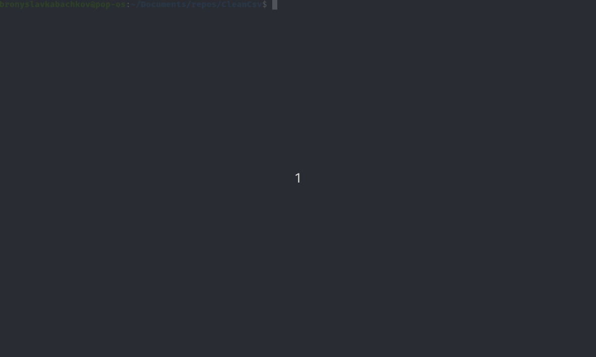

# EOIR FOIA Command Line Tool
## CleanCsv
A cli tool to optimize cleaning EOIR FOIA csv files and loading them into a postgresql databse.

## Use ALL the Data 
The [EOIR FOIA data](https://www.justice.gov/eoir/foia-library-0) is dirty. There are nul bytes, inconsistent encodings, records with more values than there are columns, etc. Additionally, the largest files have over 10 million lines. It is possible to load this data with libraries like Pandas, but it may overload your computer's memory, and it won't be able to handle the lines where there are more values than columns. Those researching the immigration court want to include all the data points in their analysis. That's what this tool is designed to do.

## Installation
The tool can be installed with pip, or via virtual env.
### Pip
For systemwide installation:
```shell
git clone https://github.com/bmare/CleanCsv.git
cd CleanCsv
python3 -m pip install --editable .
```

### Virtualenv
For installation in a virtual environment:
```shell
python3 -m pip install virtualenv
virtualenv .env
source .env/bin/activate
git clone https://github.com/bmare/CleanCsv.git
cd CleanCsv
python3 -m pip install --editable .
```

## Usage
To list the available commands run:
```shell
cleancsv --help
```
To configure the database, you will need the postgres username, password, host, port, and database name. 
```shell
cleancsv configure
```
Now you can create the db. If you don't want to come up with a name, a database named 'eoir_foia' will be created. Alternatively, you can use the `--new` option.
```shell
cleancsv createdb
```
To copy the files to the database run:
```shell
cleancsv copy-files ./path-to-eoir-foia-files
```
Depending on your machine, some of these files will take a while to copy to the database.

## Live Footage

